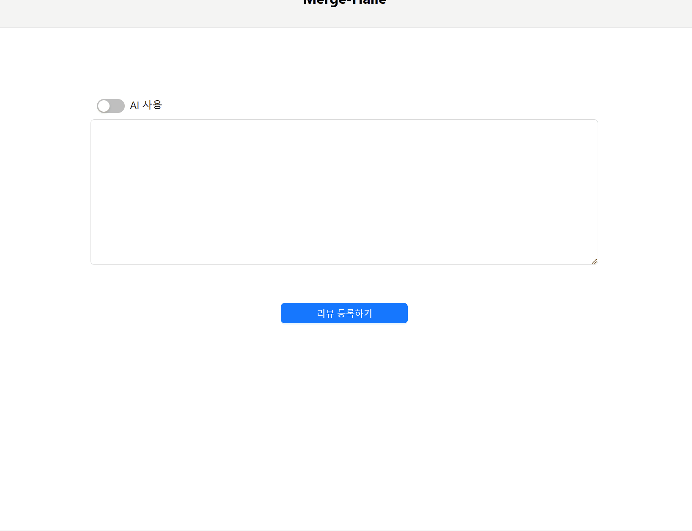
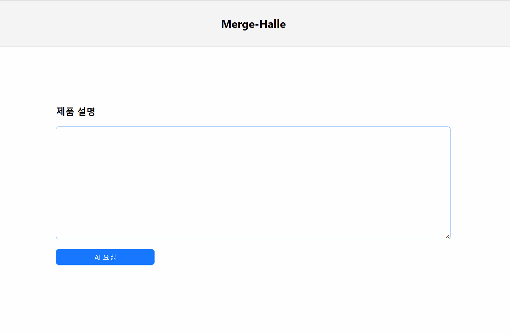

# 📌 Team composition

| 이름 | 역할 | GitHub | 기술 스택 | 이메일 |  
|------|------|--------|-----------|-------|
| 김민수 | Backend | [Doritosch](https://github.com/Doritosch) |  | example@gmail.com |
| 김보성 | Frontend | [NangManBo](https://github.com/NangManBo) |  | kimbosung22@naver.com |
| 이창의 | Backend | [changuii](https://github.com/changuii) |   | example@naver.com |
| 이상현 | Frontend, PM | [idealHyun](https://github.com/idealHyun) |  | lsh9736@gmail.com |
| 한동근 | Backend, PM | [l0o0lv](https://github.com/l0o0lv) |  | srb4719@gmail.com |

# 프로젝트 개요

이 프로젝트는 리뷰 품질 개선을 통한 마케팅도우미 "리뷰 할래?" 서비스입니다. 사용자들이 공모전 정보를 확인하고 지원하며, 참가자 리스트를 관리하고 계약서를 작성할 수 있는 기능을 제공합니다.

## 목차
- [프로젝트 개요](#프로젝트-개요)
- [스크린샷](#스크린샷)
- [비디오 데모](#비디오-데모)
- [기능](#기능)
- [사용법](#사용법)

## 스크린샷

### 1. 리뷰 작성 폼 생성

리뷰를 작성하는데 필요한 설문을 생성합니다.

### 2. 리뷰 작성 폼을 이용한 리뷰 작성기

앞에서 생성한 리뷰 설문을 이용하여 사용자에게 맞는 리뷰를 작성합니다.

